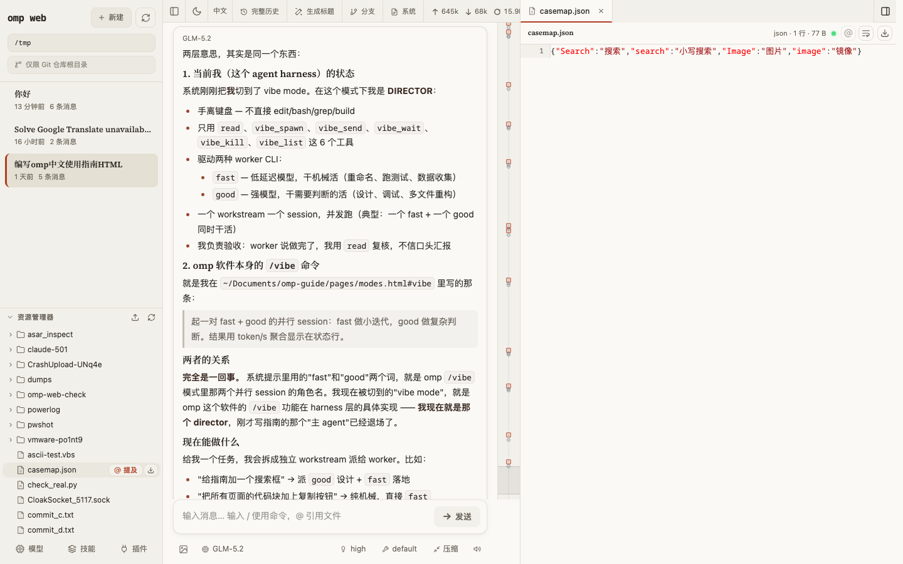
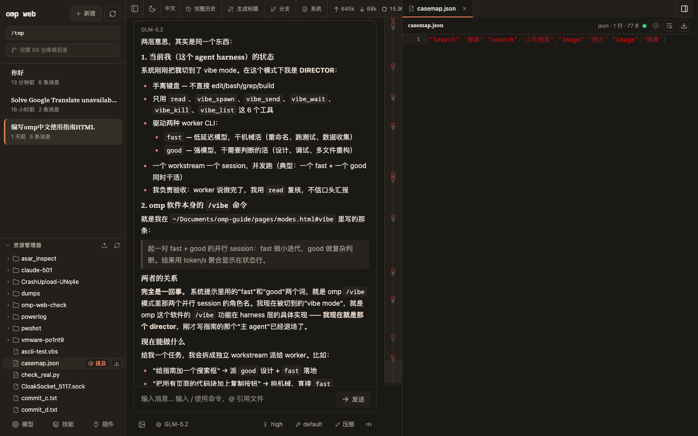
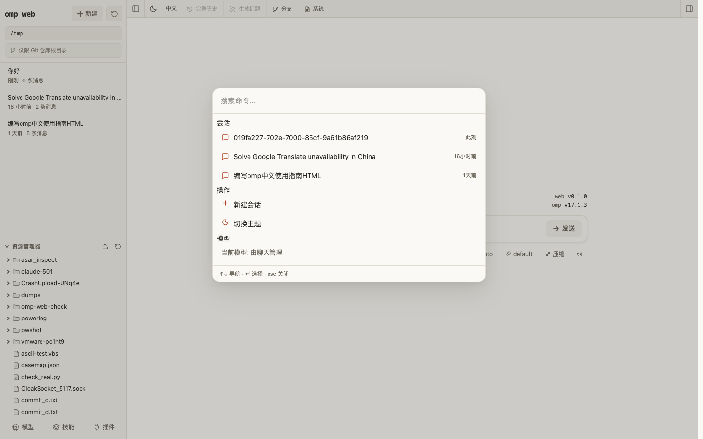

# omp web

[English](./README.md) | [简体中文](./README.zh-CN.md) | [日本語](./README.ja.md)

Local web UI for the [oh-my-pi (omp) coding agent](https://github.com/can1357/oh-my-pi). omp-web reads your local omp session files and gives you a browser workspace for session browsing, real-time chat, model configuration, skill management, and project file preview.



<details>
<summary>Dark theme &amp; command palette</summary>





</details>

## Requirements

- [omp](https://github.com/can1357/oh-my-pi) installed and on your `PATH` (or point `OMP_WEB_OMP_BIN` at the binary)
- Node.js 22.19.0 or newer (`node --version`)

## Quick Start

**Run without installing:**

```bash
npx omp-web@latest
```

**Or install globally:**

```bash
npm install -g omp-web
omp-web
```

Then open [http://127.0.0.1:30177](http://127.0.0.1:30177). The CLI will try to open the browser automatically after the server is ready. omp-web listens on `127.0.0.1` by default.

**Options:**

```bash
omp-web --port 8080              # custom port
omp-web --hostname 0.0.0.0       # expose on a trusted network
omp-web -p 8080 -H 0.0.0.0       # combine options
omp-web --no-open                # do not open the browser automatically

PORT=8080 omp-web                # environment variable is also supported
OMP_WEB_HOSTNAME=0.0.0.0 omp-web # explicit network exposure
OMP_WEB_NO_OPEN=1 omp-web        # useful when running as a background service
```

omp-web has no application-level authentication and can invoke a high-privilege agent. Do not expose it to the internet; only use non-loopback bindings on a trusted network.

## Features

- **Pick work back up**: browse previous omp conversations by project without digging through terminal history or session paths.
- **Try different directions safely**: continue from an earlier message or fork a session into a separate route.
- **Work across branches**: switch Git worktrees from the sidebar so new sessions and the Explorer follow the checkout you choose.
- **Chat beside the project**: browse files on the left and preview source, docs, images, audio, and PDFs on the right while the agent works.
- **See session state clearly**: context usage, cost, compaction state, and system prompt details are visible from the top bar.
- **Configure less from the terminal**: manage models, login/API keys, model tests, skills, and plugins from the web UI.
- **Jump anywhere with ⌘K**: a command palette (⌘K / Ctrl+K) for switching sessions, starting new ones, and toggling the theme.
- **Warm, paper-like design**: light and dark themes with serif display type and WCAG AA-verified contrast, built on a token-driven UI kit (Base UI primitives, cmdk, lucide icons).

## Configuration

| Variable | Meaning |
| --- | --- |
| `PORT` | Server port (default `30177`; `-p/--port` wins) |
| `OMP_WEB_HOSTNAME` | Bind hostname (default `127.0.0.1`; `-H/--hostname` wins) |
| `OMP_WEB_NO_OPEN` | Set to `1`/`true` to skip auto-opening the browser |
| `OMP_WEB_OMP_BIN` | Absolute path to the `omp` binary when it is not on `PATH` |
| `PI_CODING_AGENT_DIR` | Point at another omp agent directory (default `~/.omp/agent`) |
| `HTTP_PROXY` / `HTTPS_PROXY` / `NO_PROXY` | Standard proxy variables for server-side requests |

## Architecture

omp-web is a Node-hosted Next.js app that drives your installed `omp` binary — it does not embed the agent:

- **Live sessions**: spawns `omp --mode rpc-ui` (NDJSON over stdio), one child process per active session, so the agent version is always exactly what you have installed.
- **Session browsing**: reads omp's session files (`~/.omp/agent/sessions/<encoded-cwd>/<timestamp>_<uuid>.jsonl`) directly, read-only.
- **Models and auth**: RPC commands against the omp child process; the Models panel edits `models.yml` in the omp agent directory.
- **Skills and plugins**: scans omp's skill directories (`~/.omp/agent/skills`, project `.omp/skills`, and compat dirs) and shells out to `omp plugin` for plugin management.
- **File access**: file browsing and preview are scoped to the selected project directory and working directories that appear in sessions.
- **Forks vs in-session branches**: Fork creates a new `.jsonl` file. "Edit from here" creates another branch inside the same session file.

## Development

```bash
npm install
npm run dev
```

The local dev server runs at [http://127.0.0.1:30177](http://127.0.0.1:30177).

Common checks:

```bash
npx tsc --noEmit       # type check
npm run lint           # ESLint (zero warnings enforced)
node --test lib/*.test.mjs components/*.test.mjs   # run test suite
```

Avoid running `next build` / `npm run build` during local development. It writes to `.next/` and can interfere with the dev server; leave builds for release work.

## Internationalization

omp-web supports English, Simplified Chinese (简体中文), and Japanese (日本語) with 633+ translated strings covering the entire UI. The language is auto-detected from `navigator.language` and can be switched at runtime via the language menu in the top bar. The choice persists across sessions.

- Dictionaries: `lib/i18n/locales/{en,zh-CN,ja}.json`
- Framework: `lib/i18n/index.tsx` — a lightweight store built on `useSyncExternalStore` with `{var}` interpolation and plural support (`.one`/`.other`)
- API error messages are translated via stable error codes (`errors.<code>`) looked up client-side

## Quality

- **Accessibility**: WCAG AA compliant — Lighthouse a11y score 100/100, keyboard navigation throughout, focus-visible rings, ARIA roles
- **Performance**: memoized list components, RAF-gated scroll/mouse handlers, debounced search, streaming JSONL reader, ETag-cached session listing
- **Resilience**: graceful shutdown of spawned omp processes (process-group kill), error boundaries, atomic session file rewrites
- **Tests**: 166 unit tests across session parsing, terminal input, markdown rendering, and message display

## Credits

omp-web is a fork of [agegr/pi-web](https://github.com/agegr/pi-web) (MIT), the web UI for the [badlogic/pi-mono](https://github.com/badlogic/pi-mono) pi coding agent, adapted for [can1357/oh-my-pi](https://github.com/can1357/oh-my-pi).

## License

MIT
